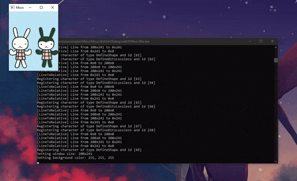

# Moco

Moco (from the word mockery) - a very bad toy flash emulator.

## How does it work?

The emulator is split into two parts: the engine and the rendering backend. The engine is completely isolated from the drawing, and is tasked with parsing the SWF file, rasterizing shapes, preparing the drawing list, issuing commands to the renderer, etc.

The rendering backend on the other hand is what draws the shapes, loads textures and displays the actual rendered frame from the display list. The design is purpose built, so you can use Moco with any backend (the sample utilizes Skia for that task).

## The purpose of this project

This will **never** be a proper flash emulator, if you want that download [Ruffle](https://ruffle.rs). This is purely a project that I'm working on out of my own curiosity and love for Adobe Flash. 

## Goals

I want it to at least be able to render simple non-ActionScript flash animations. (Definitely no ActionScript3 coming now or ever)

## Requirements

For the engine:
- .NET 6

For the Skia backend:
- SkiaSharp
- Silk.NET

## Contributing guide

If you'd really want to contribute to this project (thank you!) please adhere to the [Conventional Commits](https://www.conventionalcommits.org/en/v1.0.0/) commit format as much as you can.